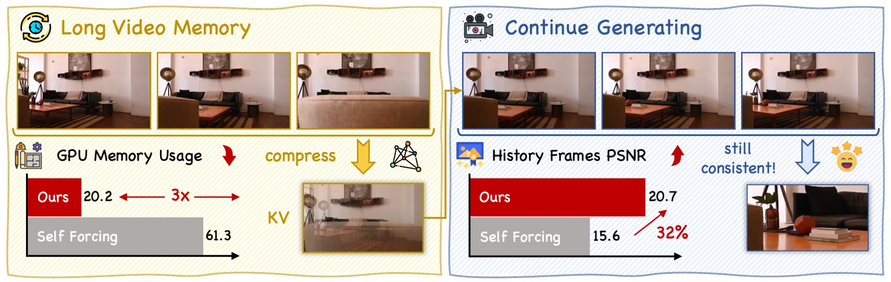

<p align="center">
  
</p>

<h1 align="center">Memorize-and-Generate (MAG)</h1>
<h3 align="center">Towards Long-Term Consistency in Real-Time Video Generation</h3>

<p align="center">
  <a href="https://xilluill.github.io/">Tianrui Zhu</a><sup>1*</sup>&nbsp;&nbsp;
  <a href="https://shiyi-zh0408.github.io/">Shiyi Zhang</a><sup>1*</sup>&nbsp;&nbsp;
  <a href="">Zhirui Sun</a><sup>1</sup>&nbsp;&nbsp;
  <a href="https://trilarflagz.github.io/">Jingqi Tian</a><sup>1</sup>&nbsp;&nbsp;
  <a href="https://andytang15.github.io/">Yansong Tang</a><sup>1&dagger;</sup>
</p>

<p align="center">
  <sup>1</sup>Tsinghua Shenzhen International Graduate School, Tsinghua University<br>
  <sup>*</sup>Equal contribution&nbsp;&nbsp;<sup>&dagger;</sup>Corresponding author
</p>

<p align="center">
  <a href="https://arxiv.org/abs/2512.18741"></a>
  <a href="https://huggingface.co/xilluill/MAG"></a>
  <a href="LICENSE.md"></a>
</p>

---

<p align="center">
  
</p>

## Overview

**Memorize-and-Generate (MAG)** is a framework for real-time long video generation that decouples memory compression and frame generation into two distinct tasks. Current approaches in long video generation typically rely on window attention, which either discards historical context (leading to catastrophic forgetting and scene inconsistency) or retains full history (incurring prohibitive memory costs).

MAG addresses this trade-off by training:
- A **memory model** that compresses historical information into a compact KV cache, achieving **3x memory compression** while faithfully reconstructing original pixel frames.
- A **generator model** that synthesizes subsequent frames utilizing the compressed representation, producing high-quality content in **real-time at 16 FPS** on a single GPU with superior background and subject consistency.

We also introduce **MAG-Bench**, a lightweight benchmark consisting of videos with camera trajectories that leave and return to scenes, designed to evaluate historical scene consistency.

## Installation

Create a conda environment and install dependencies:

```bash
conda create -n MAG python=3.10 -y
conda activate MAG
pip install -r requirements.txt
pip install flash_attn==2.7.4.post1 --no-build-isolation
pip install -e . --config-settings editable_mode=compat
```

## Download Checkpoints & Data

All checkpoints and the MAG-Bench dataset are hosted on our [HuggingFace repository](https://huggingface.co/xilluill/MAG).

```bash
# Download Wan2.1 base model
huggingface-cli download Wan-AI/Wan2.1-T2V-1.3B --local-dir wan_models/

# Download MAG checkpoints (generator + memory model + benchmark)
huggingface-cli download xilluill/MAG --local-dir .

```

> **Note:** After downloading, update the checkpoint paths in the corresponding config files under `configs/` (e.g., `generator_ckpt`, `memory_ckpt`, `checkpoint_path`) to match your local directory structure.

---

## Inference

### Text-to-Video Generation

Generate videos from text prompts using the MAG pipeline:

```bash
torchrun \
    --nnodes=1 \
    --nproc_per_node=NUM_GPUS \
    inference_memory_generation.py \
    --config_path configs/magbench_inference.yaml \
    --output_folder OUTPUT_DIR \
    --checkpoint_path PATH_TO_GENERATOR_CKPT \
    --memory_checkpoint_path PATH_TO_MEMORY_CKPT \
    --data_path prompts/MovieGenVideoBench_extended.txt \
    --num_output_frames 21 \
    --num_samples 1
```

For long video generation (e.g., 120 frames / ~30s), increase `--num_output_frames`:

```bash
torchrun \
    --nnodes=1 \
    --nproc_per_node=NUM_GPUS \
    inference_memory_generation.py \
    --config_path configs/magbench_inference.yaml \
    --output_folder OUTPUT_DIR \
    --checkpoint_path PATH_TO_GENERATOR_CKPT \
    --memory_checkpoint_path PATH_TO_MEMORY_CKPT \
    --data_path prompts/MovieGenVideoBench_extended.txt \
    --num_output_frames 120 \
    --num_samples 5
```

### Block Compression Evaluation

Evaluate the memory model's compression quality:

```bash
torchrun \
    --nnodes=1 \
    --nproc_per_node=NUM_GPUS \
    inference_compress.py \
    --config_path configs/bc_inference.yaml \
    --output_folder OUTPUT_DIR \
    --checkpoint_path PATH_TO_MEMORY_CKPT \
    --video_path PATH_TO_TEST_VIDEOS \
    --csv_path PATH_TO_TEST_CSV \
    --num_output_frames 21 \
    --num_samples 1
```

### MAG-Bench Evaluation

Evaluate historical scene consistency on MAG-Bench:

```bash
torchrun \
    --nnodes=1 \
    --nproc_per_node=NUM_GPUS \
    inference_magbench.py \
    --config_path configs/magbench_inference.yaml \
    --output_folder OUTPUT_DIR \
    --checkpoint_path PATH_TO_GENERATOR_CKPT \
    --memory_checkpoint_path PATH_TO_MEMORY_CKPT \
    --video_path PATH_TO_MAGBENCH_VIDEOS \
    --csv_path PATH_TO_MAGBENCH_CSV \
    --num_output_frames 21 \
    --num_samples 1 \
    --use_memory_model \
    --use_prompt
```

Reference bash scripts for all inference modes are available in [`scripts/single_inference/`](scripts/single_inference/).

---

## Training

MAG training consists of three sequential stages. Our training algorithm is **data-free** (no video data is needed) -- only text prompts are required.

### Stage 1: Self Forcing Training with DMD

Train the base causal generation model using Distribution Matching Distillation:

```bash
accelerate launch \
    --config_file configs/acc_mixbf16_fsdp1_dmd.yaml \
    trainer/long_dmd_acc.py \
    --config_path configs/long_dmd.yaml
```

### Stage 2: Memory Model Compression Training

Train the memory model to compress KV cache blocks:

```bash
accelerate launch \
    --config_file configs/acc_mixbf16_fsdp1_dmd.yaml \
    trainer/block_compress.py \
    --config_path configs/block_compress.yaml
```

### Stage 3: MAG Streaming Training

Joint training of the generator with the compressed memory model:

```bash
accelerate launch \
    --config_file configs/acc_mixbf16_fsdp1_dmd.yaml \
    trainer/memory_generation_all.py \
    --config_path configs/mag.yaml
```

> **Note:** Update checkpoint paths in config files (`configs/long_dmd.yaml`, `configs/block_compress.yaml`, `configs/mag.yaml`) before training. Multi-node training scripts are available in [`scripts/block_compress_node/`](scripts/block_compress_node/) and [`scripts/memory_generation_node/`](scripts/memory_generation_node/).

### Training Resources

- **Full run:** 600 iterations, < 2 hours on 64 H100 GPUs.
- **Reduced setup:** Reproducible in ~16 hours on 8 H100 GPUs with gradient accumulation.

---

## Project Structure

```
.
├── configs/                  # Training and inference configurations
├── model/                    # Core model implementations (DMD, memory, compression)
├── trainer/                  # Training scripts for each stage
├── pipeline/                 # Inference pipelines
├── scripts/                  # Bash scripts for training and inference
├── wan/                      # Modified Wan2.1 model implementation
├── evaluate/                 # VAE metrics and evaluation utilities
├── utils/                    # Utility modules (dataset, distributed, scheduler, etc.)
├── prompts/                  # Text prompt datasets
├── inference_memory_generation.py   # Text-to-video inference
├── inference_compress.py            # Block compression evaluation
├── inference_magbench.py            # MAG-Bench evaluation
├── requirements.txt
└── setup.py
```

---

## Acknowledgements

This project builds upon several excellent open-source works:

- [Self Forcing](https://github.com/Yiming-Huang-github/Self-Forcing) -- Bridging the train-test gap in autoregressive video diffusion.
- [Wan2.1](https://github.com/Wan-Video/Wan2.1) -- Open and advanced large-scale video generative models.
- [VBench](https://github.com/Vchitect/VBench) -- Comprehensive benchmark suite for video generative models.

---

## Citation

If you find this work helpful for your research, please consider citing our paper:

```bibtex
@article{zhu2025memorize,
  title={Memorize-and-Generate: Towards Long-Term Consistency in Real-Time Video Generation},
  author={Zhu, Tianrui and Zhang, Shiyi and Sun, Zhirui and Tian, Jingqi and Tang, Yansong},
  journal={arXiv preprint arXiv:2512.18741},
  year={2025}
}
```

---

## License

This project is licensed under the [CC BY-NC-SA 4.0](LICENSE.md) License.
